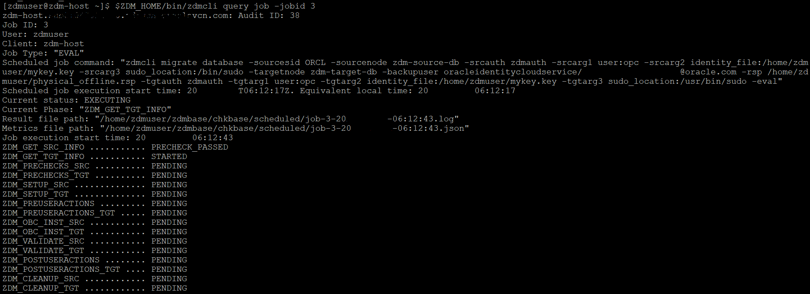
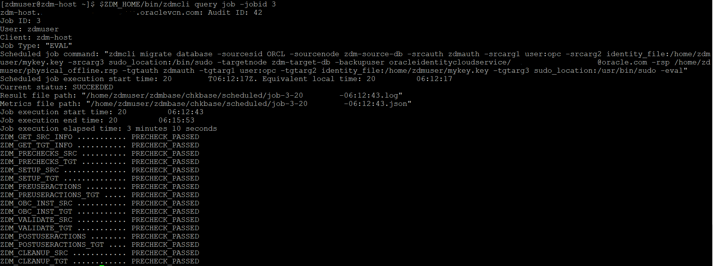
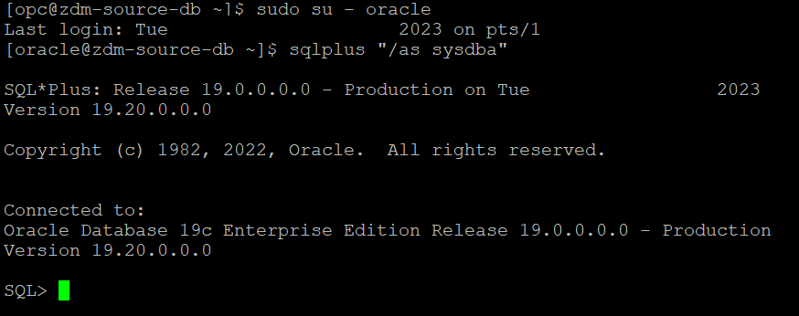
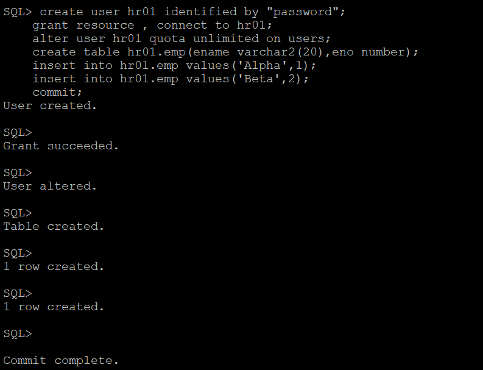
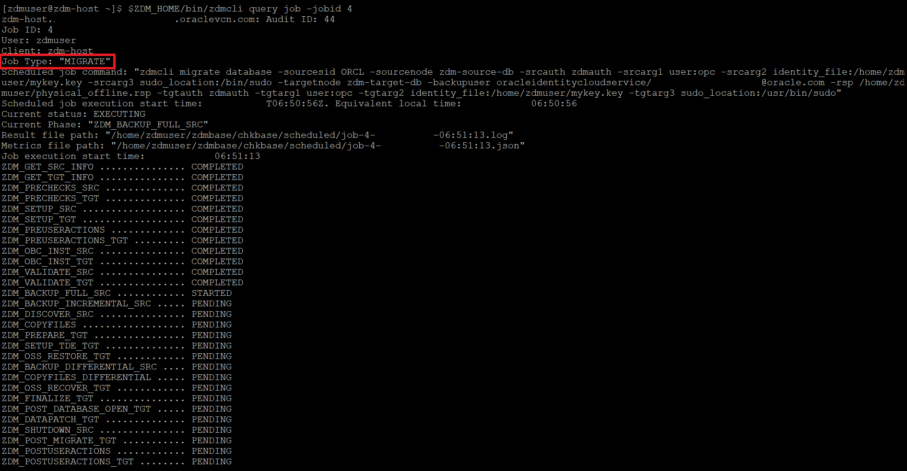
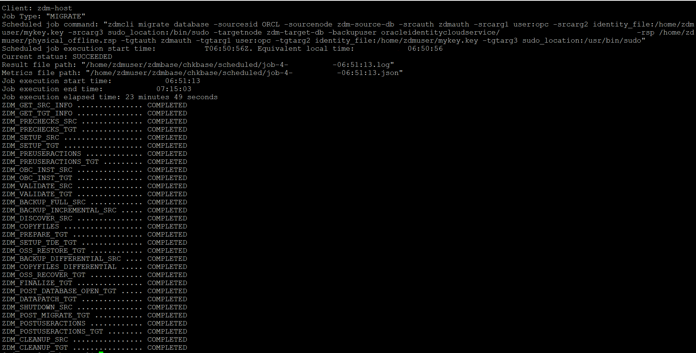

# Migrate database

## Introduction

Estimated Time: 45 minutes

### Objectives

In this lab

* You will prepare a response file for database migration.

* You will evaluate a database migration.

* You will perform the actual database migration.

### Prerequisites

* All previous labs have been successfully completed.

## Task 1 : Prepare Response File

1. Login to ZDM service host.

   Login to ZDM service host using Public IP and ssh key.

2. Switch user to **zdmuser**.

   Switch user to **zdmuser** using below command.

   **sudo su - zdmuser**
      
3. Prepare a response file.

   Below is a sample response file which you can use for ZDM Physical Offline Migration.
   
    ```text 
    <copy>
    TGT_DB_UNIQUE_NAME=ORCL_T
    MIGRATION_METHOD=OFFLINE_PHYSICAL
    DATA_TRANSFER_MEDIUM=OSS
    HOST=https://swiftobjectstorage.uk-london-1.oraclecloud.com/v1/xxxxxxxxx
    OPC_CONTAINER=ZDM-Physical
    PLATFORM_TYPE=VMDB
    SHUTDOWN_SRC=TRUE
    </copy>
    ```

   Below is a brief description of the parameters used in the above response file.

   TGT\_DB\_UNIQUE\_NAME - Value of target database DB\_UNIQUE\_NAME (ORCL\_T is the one for this lab).

   MIGRATION\_METHOD - Specifies the migration method used (OFFLINE\_PHYSICAL is used in this lab).

   DATA\_TRANSFER\_MEDIUM - Specifies the media used for source database backup (Object Storage Service is used in this lab).

   HOST - Specifies the cloud storage REST endpoint URL to access Oracle Cloud Object Storage ( Please refer later steps to prepare this).

   OPC_CONTAINER - Specifies the Object Storage Bucket used for source database backup.

   PLATFORM_TYPE - Specifies the target database platform (VMDB is used for this lab which indicates target platform is Oracle Cloud Infrastructure(OCI) virtual machine or bare metal).

   SHUTDOWN_SRC - Specifies whether or not to shut down the source database after migration completes (TRUE indicates source database will be shutdown after migration).

   Please refer below document for more details about each parameter.

   https://docs.oracle.com/en/database/oracle/zero-downtime-migration/index.html

   Use below method to prepare HOST value for your environment.

   Use the below format.

   **https://swiftobjectstorage.&ltregion\_name&gt.oraclecloud.com/v1/&ltobjectstorage\_namespace&gt**

   Replace **region\_name** and **objectstorage\_namespace** with your corresponding values.

   **objectstorage\_namespace** value for your environment was collected in Lab 7 Task 1.

   Save the response file parameters to a file named as **physical\_offline.rsp** under directory **/home/zdmuser**.

   Please note that this lab is using minimal parameters for migration , however more flexibility and control can be achieved by using other available options in the below document.

   https://docs.oracle.com/en/database/oracle/zero-downtime-migration/index.html

   
## Task 2 : Start Database Migration Evaluation

1. Login to ZDM service host.

   Login to ZDM service host and switch the user to **zdmuser**.

2. Check the status of ZDM service.

   Execute below commands.

   **export ZDM_HOME=/home/zdmuser/zdmhome**

   **$ZDM_HOME/bin/zdmservice status**

   If you see similar output as below which shows **Running** as **false**, then the ZDM service is down.

   
   
   Please use the below command to start the ZDM service.

   **$ZDM_HOME/bin/zdmservice start**

3. Prepare command for ZDM Physical Offline Migration Evaluation.

   Use the below sample command for ZDM database migration evaluation and update it as per your environment.

    ```text
    <copy>
    $ZDM_HOME/bin/zdmcli migrate database  -sourcesid ORCL  -sourcenode zdm-source-db  -srcauth zdmauth  -srcarg1 user:opc  -srcarg2 identity_file:/home/zdmuser/mykey.key  -srcarg3 sudo_location:/bin/sudo  -targetnode zdm-target-db  -backupuser "xxxxxxxx/xxxxxx.xxxxx@xxxxx.com"  -rsp /home/zdmuser/physical_offline.rsp  -tgtauth zdmauth  -tgtarg1 user:opc  -tgtarg2 identity_file:/home/zdmuser/mykey.key  -tgtarg3 sudo_location:/usr/bin/sudo -eval
    </copy>
    ```
  
   Below is a brief description of the parameters used in above command.

   -sourcesid  - ORACLE_SID of the source single instance database without Grid Infrastructure.

   -srcauth    - Specify the plug-in-name to access the source database server.

      This lab is using **zdmauth** which requires below arguments.

     -srcarg1 user:source\_database\_server\_login\_user_name

     -srcarg2 identity\_file:ZDM\_installed\_user\_private\_key\_file\_location

     -srcarg3 sudo\_location:sudo\_location
                 
   -targetnode - Host name of the target database server.

   -backupuser - Name of the OCI tenancy user allowed to backup or restore the database.

   -rsp        - Location of the Zero Downtime Migration response file.

   -tgtauth    - Specify the plug-in-name to access target database server.

      This lab is using **zdmauth** which requires below arguments.

     -tgtarg1 user:target\_database\_server\_login\_user_name

     -tgtarg2 identity_file:ZDM\_installed\_user\_private\_key\_file\_location 

     -tgtarg3 sudo_location:sudo\_location

    -eval       - Evaluates the migration job without actually running the migration job against the source and target.

     Please refer below document to know more about the parameters used in migration command.

     https://docs.oracle.com/en/database/oracle/zero-downtime-migration/index.html

4. Perform database migration evaluation.

   Please proceed with the migration evaluation once you have the command updated for your environment.

   

   Please provide the SYS password of source database and Auth token when asked.

   Also note down the migration job ID which is 3 in this case.

5. Monitor the database migration evaluation.

   Check the status of database migration evaluation using below command.

   **$ZDM_HOME/bin/zdmcli query job -jobid 3**

   Here 3 is the jobid.

   You will receive a similar ouput as below.

   

   Continue to execute the status command until all phases have been completed with status **PRECHECK_PASSED** as shown below.

   

## Task 3 : Start Database Migration

1. Create **HR01.EMP** table in source database.

   You will create a user called **HR01** and a table called **EMP** under PDB called **ORCLPDB** in the source database.

   This is to enable you to perform a quick check on the success of database migration.

   a. Login to source database server.

   Login to source database using Public IP and ssh key.

   b.Set the environment for the database.

   Switch user to **oracle** using below command.

   **sudo su - oracle**

   Set the environment to connect to your database.

   Type **. oraenv** and press **Enter**. 
    
   Enter **ORCL** when asked for **ORACLE\_SID** and then press **Enter** (Enter your ORACLE\_SID if that is different in case of an on premises-database).    
   
   c. Login to source pluggable database.

   Login to CDB using sqlplus as shown below.
   
      
    
   Switch to pluggable database ORCLPDB using below command. 
   
   **alter session set container=ORCLPDB;**

   You will see similar output as below once you are switched to ORCLPDB pluggable database.

   

   Execute below statements while you are connected to ORCLPDB.

    ```text
    <copy>
    create user hr01 identified by "password";
    grant resource , connect to hr01;
    alter user hr01 quota unlimited on users;
    create table hr01.emp(ename varchar2(20),eno number);
    insert into hr01.emp values('Alpha',1);
    insert into hr01.emp values('Beta',2);
    commit;
    </copy>
    ```
   
   You will receive below output.

   

   d. Verify the data in HR01.EMP table.

   Execute below statement when you are in ORCLPDB.
    ```text
    <copy>
    select * from hr01.emp;
    </copy>
    ```

    You will receive the below output which shows that there are 2 rows in HR01.EMP table.

    

2. Verify **HR01.EMP** table in target database.

   There is no HR01.EMP table in target database , However let's verify it.

   a. Connect to target database server.

   Connect to target database server using Public IP and ssh key.

   b.Set the environment for the database.

   Switch user to **oracle** using below command.

   **sudo su - oracle**

   Set the environment to connect to your database.

   Type **. oraenv** and press **Enter**. 
    
   Enter **ORCL** when asked for **ORACLE\_SID** and then press **Enter** (Enter your ORACLE\_SID if that is different).

   c. Connect to target pluggable database.

   Login to CDB using sqlplus as shown below.
   
   

   Switch to pluggable database ORCL_PDB1 using below command. 
   
   **alter session set container=ORCL_PDB1;**

   d. Verify existence of HR01.EMP table.

    ```text
    <copy>
    select * from hr01.emp;
    </copy>
    ```

   You will receive an output similar to the one below indicating that HR01.EMP table doesn't exist in target database which is expected.

   

3. Start the database migration

   You are now good to start the database migration.

   You will use the same command used for database migration evaluation except that **-eval** flag is not required.

   a. Login to ZDM service host.

   Login to ZDM service host using Public IP and ssh key.

   b. Switch user to zdmuser.

   Switch user to **zdmuser** using below command.

   **sudo su - zdmuser**
   
   c. Execute database migration as below.

   Execute below command to start the database migration.
    ```text
    <copy>
    $ZDM_HOME/bin/zdmcli migrate database -sourcesid ORCL -sourcenode zdm-source-db  -srcauth zdmauth -srcarg1 user:opc  -srcarg2 identity_file:/home/zdmuser/mykey.key -srcarg3 sudo_location:/bin/sudo -targetnode zdm-target-db  -backupuser "oracleidentitycloudservice/xxxxx.xxxx@xxxcle.com" -rsp /home/zdmuser/physical_offline.rsp -tgtauth zdmauth -tgtarg1 user:opc  -tgtarg2 identity_file:/home/zdmuser/mykey.key -tgtarg3 sudo_location:/usr/bin/sudo
    </copy>
    ```
   

   Please provide the SYS password of source database and Auth token when asked.

   Also note down the migration job ID which is 4 in this case.
   
   d. Monitor the database migration using below command.

   **$ZDM_HOME/bin/zdmcli query job -jobid 4**

   You will get a output similar to below.

   

   You will see the **JOB\_TYPE** is **MIGRATE** which is different from **JOB\_TYPE** (EVAL) for the database migration evaluation.
      
   Continue to monitor the status until all phases have been completed with **COMPLETED** status as shown below.

   

4. Verify the database migration.

   ZDM has completed the database migration as seen in the previous output.

   Let's verify the **HR01.EMP** table in target database.

   a. Connect to target database server.

   Connect to target database server using Public IP and ssh key.

   b. Set the environment for the database.

   Switch user to **oracle** using below command.

   **sudo su - oracle**

   Set the environment to connect to your database.

   Type **. oraenv** and press **Enter**. 
    
   Enter **ORCL** when asked for **ORACLE\_SID** and then press **Enter** (Enter your ORACLE\_SID if that is different).
   
   c. Login to target pluggable database.

   Login to CDB using sqlplus as shown below.
   
      
    
   Switch to pluggable database ORCLPDB using below command. 
   
   **alter session set container=ORCLPDB;**

   d. Check for number of rows in HR01.EMP table.

    ```text
    <copy>
    select * from hr01.emp;
    </copy>
    ```
   If you receive similar output as below which means database migration has been successfully completed.
   


Congrats, you have completed ZDM Physical Offline Migration Live Lab.

## Acknowledgements
* **Author** - Amalraj Puthenchira, Cloud Data Management Modernise Specialist, EMEA Technology Cloud Engineering
* **Last Updated By/Date** - Amalraj Puthenchira, January 2023


