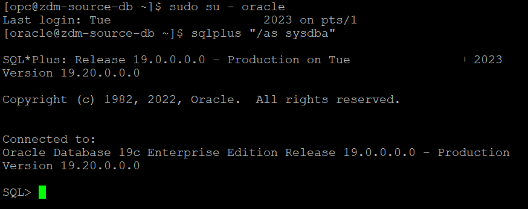
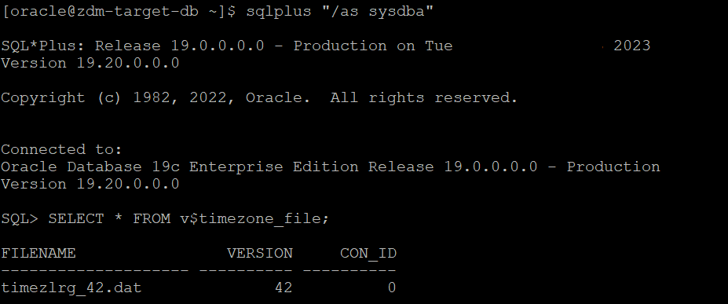
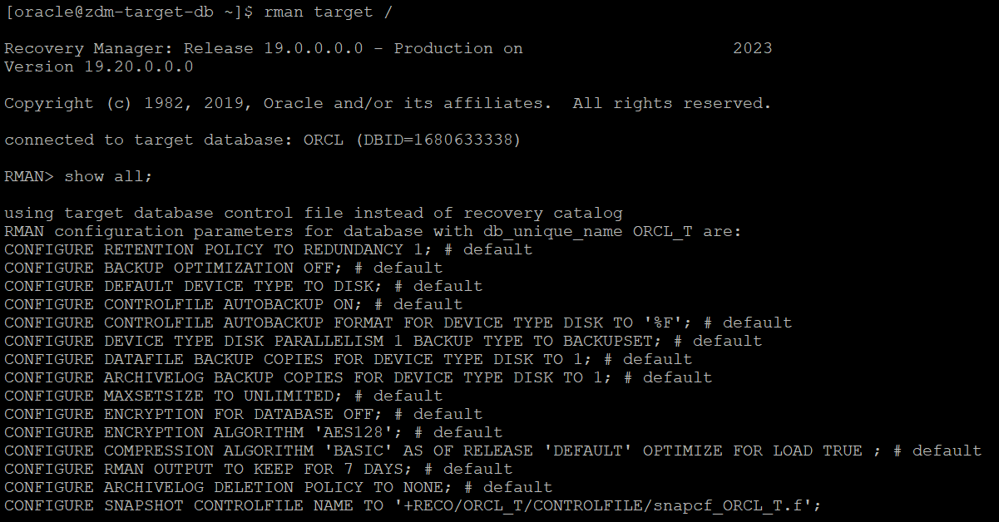

# Prepare target database

## Introduction

Estimated Time: 10 minutes

### Objectives

In this lab

* You will check target database to identify whether it meets prerequistes for ZDM Physical Offline Database Migration.

* You will perform necessary steps to modify target database when required so that it meets the migration prerequisites.


### Prerequisites

* All previous labs have been successfully completed.

## Task 1 : Prepare Target Database

1. Establish connection to target database.
   
   Please follow below steps to establish connection to target database using SQLPLUS.

   Login to target database server using Public IP and ssh key.

   Switch user to **oracle** using below command.

   **sudo su - oracle**

   Type **sqlplus "/as sysdba"** and press **Enter** to connect to target database as SYS user.

   Please find below snippet of the connection steps.

   

2. Establish connection to source database.

   Please follow below steps to establish connection to source database using SQLPLUS.

   Login to source database server using Public IP and ssh key.

   Switch user to **oracle** using below command.

   **sudo su - oracle**

   Type **sqlplus "/as sysdba"**  and press **Enter** to connect to source database as SYS user.

   Please find below snippet of the connection steps.

   

3. Ensure the target timezone version is same or higher than the source.

   Please ensure that the target placeholder database has a time zone file version that is the same or higher than the source database. 
   
   If that is not the case, then the time zone file has to be upgraded in the target placeholder database.

   Please follow the below steps to verify the timezone version.

   i. Check the timezone of source database server.

   Execute below query using the source database connection established using step 2.
   
    ```text
     <copy>
     SELECT * FROM v$timezone_file;
     </copy>
     ```   
     Sample output is shown below.   
     

   ii. Check the timezone of target database server.

   Execute below query using the target database connection established using step 1.
   
    ```text
     <copy>
     SELECT * FROM v$timezone_file;
     </copy>
     ```   
     Sample output is shown below.   
     
   
   iii. Ensure timezone of target database sever is same or higher than source database.

   Compare the values of timezone collected in step i and ii and ensure target timezone is same or higher than source database.

   For e.g

   The Target database timezone is 42 for this lab which is greater then the source timezone version of 32 , which means no further action is to be taken.
   
   If the target timezone version is lower than the source database, follow the below document to do the timezone upgrade for an Oracle 19c target database.

   https://docs.oracle.com/en/database/oracle/oracle-database/19/nlspg/datetime-data-types-and-time-zone-support.html#GUID-B0ACDB2E-4B49-4EB4-B4CC-9260DAE1567A
   
4. Check whether target database is using spfile.

   Please ignore this step if you have provisioned the target database as per the instructions in this lab.

   Follow the below steps for the target database that you have provisioned using steps not mentioned in this livelab.

   Execute below statement using target database connection (established using step 1) to check whether SPFILE is in use.

     ```text
     <copy>
     show parameter spfile
     </copy>
     ```

   If the above query output shows a value for the SPFILE parameter, it means the SPFILE is already in use.

   Sample output with SPFILE in use is shown below.

   

   If SPFILE is not in use, then use the below link to configure SPFILE for your database.

   https://docs.oracle.com/en/database/oracle/oracle-database/19/admin/creating-and-configuring-an-oracle-database.html#GUID-1C90AAE6-1E89-47B9-B218-C2B0ED659B60

5. Verify TDE Wallet Folder.

   Please ignore this step if you have provisioned the target database as per the instructions in this lab.

   Please follow the below steps if you have provisioned the target database using methods not mentioned in this lab.

   Execute the below SQL.
     ```text
     <copy>
     set lines 120
     col WRL_PARAMETER for a50
     select WRL_TYPE,WRL_PARAMETER,STATUS,WALLET_TYPE from v$encryption_wallet;
     </copy>   
     ```
     Sample output is shown below.

     

     Verify that the TDE wallet folder(value of WRL\_PARAMETER in the above output) exists, and ensure that the wallet STATUS is OPEN and WALLET\_TYPE is AUTOLOGIN (For an auto-login wallet type), or WALLET\_TYPE is PASSWORD (For a password-based wallet). 
   
     For a multitenant database, ensure that the wallet is open on all PDBs as well as the CDB, and the master key is set for all PDBs and the CDB.

     If the query output is not as per the above recommendation,  please do the needful to enable TDE in the target database.

6. Check available free space in target database server.
   
   You can ignore this step if you have provisioned the source and target database as per the instructions in this lab.

   Please follow the below steps if you have provisioned the target database using methods not mentioned in this lab.

   Check the size of the target database ASM diskgroup (or File System) where you plan to keep the database files to ensure adequate storage has been provisioned and available on the target database server.

   Below is a sample output of lsdg (command to check diskgroup details) command which can be used to check the free space of an ASM diskgroup.

   

   Please note that the **Usable\_file\_MB** in the output shows the available space for a specific diskgroup which should be higher than the size of your source database.
  
7. Check connectivity.

   Verify that port 22 on the target servers in the Oracle Cloud Infrastructure, Exadata Cloud Service, or Exadata Cloud at Customer environment are open and not blocked by a firewall.

   We had already verified this in earlier lab (Provision and configure ZDM service host).

8. Capture RMAN SHOW ALL command.

   Capture output of RMAN **SHOW ALL** command so that you can compare RMAN settings after the migration, then reset any changed RMAN configuration settings to ensure that the backup works without any issues.

   Please find sample output of **SHOW ALL** command.

   

9. Ensure system time of target database, source database and ZDM host are in sync (optional step).

   Execute **date** command across source , target and ZDM service host simultaneously and see whether they show the same time.

   Please find below sample output of **date** command from source , target and zdm service host.

   

   

   

   It is recommended to have same time across all system but it is not mandatory.

   Please use NTP in case you need to adjust time.

10. Check encryption algorithm in sqlnet.ora (optional step).

   Ensure that encryption algorithm specificed in sqlnet.ora in target database Oracle Home is same as source database Oracle Home.

   This is not mandatory for ZDM Physical Offline Migration , however it is recommended.

   Below is sample output of the contents of sqlnet.ora from source database server.

   

   Below is sample output of the contents of sqlnet.ora from target database server.

   

You may now **proceed to the next lab**.

## Acknowledgements
* **Author** - Amalraj Puthenchira, Data Management Modernise Specialist, EMEA Technology Engineering
* **Last Updated By/Date** - Amalraj Puthenchira, November 2023

