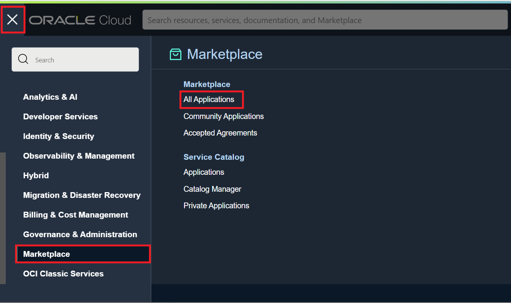
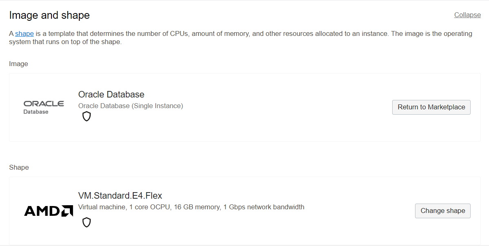

# Source Database Provisioning

In this lab, you will provision a source database using Oracle Marketplace image available in Oracle Cloud Infrastructure.

Estimated Time: 30 mins
## Task 1 - Create new Virtual Cloud Network

In this task we will create a new VCN which will be used to host Source Database Compute , Target DB systema and ZDM Service Host.

1. Login to your Oracle Cloud Console.

2. Click the Navigation Menu in the upper left, navigate to Networking and then select Virtual Cloud Networks
   
     
 
3. Click on "Start VCN Wizard"

     

4. In the new small window , Select the "Create VCN with Internet Connectivity" and then click on "Start VCN Wizard"

     

5. In new window , under Basic information specify name of VCN as ZDM-VCN and select appropritate compartment.

     

6. Under Configure VCN and Subnets , enter details as shown in image below.

     

Once details are entered , Click on Next

7. On the next screen , Click on Create

     

8. This will take few seconds and you will receive a screen similar to the one below after completion.

     

## Task 2 - Provision Source Database.

1. Login to your Oracle Cloud Console.

2. Click the Navigation Menu in the upper left, navigate to Marketplace and then select All Applications.

     

3. Type "Oracle Database" in search bar.

     

4. Click on the listed "Oracle Database (Single Instance) Image

     

5. Select an Oracle Database version which is latest ( You will same latest version on OL7 and OL8)
    
   We have choosen OL7 since we would like to match the target OS as close as possible.

     

6. Ensure to select the correct compartment in your tenancy and then click on "Launch Instance"

     

7. On the Create compute instance page , Please update Name for Compute.

     

    You can leave the Image and Shape as Default.

     

 8. Under Networking , Make choices to reflect the below details

     

 9. Under Add SSH Keys

    Browse and provide the ssh key generated earlier.

    

10. Click on "Create" to start the compute provisioning.

    

## Learn More

* [Oracle Zero Downtime Migration - Product Page](http://www.oracle.com/goto/zdm)
* [Oracle Zero Downtime Migration - Product Documentation](https://docs.oracle.com/en/database/oracle/zero-downtime-migration/)
* [Oracle Zero Downtime Migration - Logical Migration Step by Step Guide](https://www.oracle.com/a/tech/docs/oracle-zdm-logical-migration-step-by-step-guide.pdf)
* [Oracle Zero Downtime Migration - Physical Migration Step by Step Guide](https://www.oracle.com/a/tech/docs/oracle-zdm-step-by-step-guide.pdf)

## Acknowledgements
* **Author** - Amalraj Puthenchira, Cloud Data Management Modernise Specialist, EMEA Technology Cloud Engineering
* **Contributors** - LiveLabs Team, ZDM Development Team
* **Last Updated By/Date** - Ricardo Gonzalez, January 2022

[def]: ./images/task1navigate.png