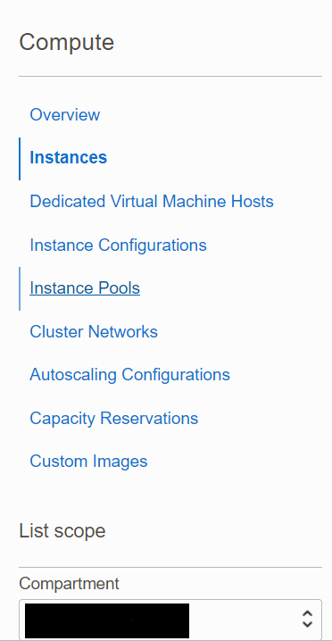
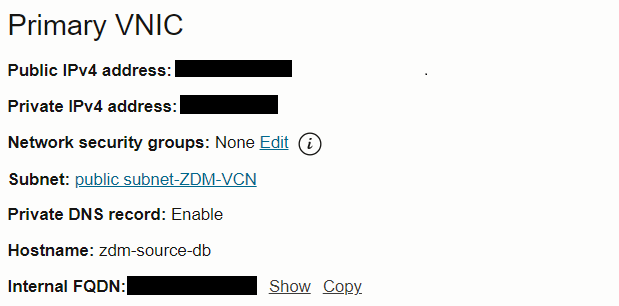

# Provision and configure ZDM service host

## Introduction

Estimated Time: 30 minutes

### Objectives

In this lab

* You will provision a compute instance to use as ZDM servive host.
* You will configure ZDM software on the compute instance.

### Prerequisites

This lab assumes you have :

* Oracle Cloud Account

* All previous labs have been successfully completed.

## Task 1 : Provision ZDM Compute Instance

1. Navigate to compute instance in Oracle Console.

   Click the navigation Menu in the upper left, navigate to Compute and then select Instances.

   

2. Select Compartment.

   Select the appropriate compartment on the left side of the console.

   

3. Click on "Create Instance".

   

4. Enter name for compute.

   Enter "zdm-host" as name for compute and select appropriate compartment if it is not already done.

   

5. Leave the "Placement" section as it is.

6. Select correct image.

   Under Image and Shape , click on "Change image".

   

   Select "Oracle Linux 7.9" and click on "Select Image"

   

7. Select VCN and Subnet.

   Under Networking , Select "ZDM-VCN" as VCN and "Public Subnet-ZDM-VCN" as subnet.

   

8. Upload SSH Keys.

   Under Add SSH Keys , upload the public ssh key generated earlier.

   

9. Specify custom boot volume.

   Under boot volume , select "Specify a custom boot volume size" and specify 150.

   
10. Click on "Create" to start the provisioning of compute.

   In less than few minutes ZDM compute instance will be provisioned.

## Task 2 : Configure ZDM Service

1. Login to ZDM host using the Public IP and ssh key file.

   

2. Expand the root FS

   Execute below command as "opc" user and press y and Enter when asked.

   sudo /usr/libexec/oci-growfs

   You will see an output similar to the one below.

   

3. Check the existence of required packages for ZDM.

   ZDM software requires below packages to be installed.

   glibc-devel

   expect

   unzip

   libaio

   oraclelinux-developer-release-el7

   Execute the below command to identify already installed packages.
   ```console
   <copy>
   yum list installed glibc-devel expect unzip libaio oraclelinux-developer-release-
   </copy>
   ```
   You will receive an output similar to the one below which shows glibc-devel, libaio , oraclelinux-developer-release-e17 and unzip are alraady installed.

   

4. Install missing packages.

   We have seen that "expect" package is missing as per previous step output.

   Install the "expect" package using commands below.

   sudo yum install -y expect

   Sample output is shown below.

   

5. Create user, group and directories required for ZDM.

   Switch to "root" user using below command.

   sudo su -

   Execute below commands.
   ```console
   <copy>
   groupadd zdm
   useradd -g zdm zdmuser
   mkdir -p /home/zdmuser/zdminstall
   mkdir /home/zdmuser/zdmhome
   mkdir /home/zdmuser/zdmbase
   chown -R zdmuser:zdm /home/
   </copy>
   ```
6. Download ZDM software.

   Download the ZDM software from below URL.

   https://www.oracle.com/database/technologies/rac/zdm-downloads.html

7. Upload ZDM software to ZDM host.

   Upload the software to /tmp in ZDM host.

   Ensure that all users can read the .zip file.

8. Unzip the ZDM software.

   Switch user to "zdmuser" using below command.

   sudo su - zdmuser
   
   Unzip the ZDM software under /tmp directory.

   Notedown the path of unzipped folder , it will be "/tmp/zdm21.3" for ZDM 21.3.

9. Install ZDM software.

   Change directory to ZDM unzipped location using below command.

   cd /tmp/zdm21.3
   
   Execute the below command to install ZDM software.
   ```console
   <copy>
   ./zdminstall.sh setup oraclehome=/home/zdmuser/zdmhome oraclebase=/home/zdmuser/zdmbase ziploc=/tmp/zdm21.3/zdm_home.zip -zdm
   </copy>
   ```
   This will take couple of minutes.

   You will see output as below when ZDM service setup has been completed.

   

10. Start ZDM service.

    Navigate using below command.

    cd /home/zdmuser/zdmhome/bin

    Execute below command to start ZDM.

    ./zdmservice start

    You will receive similar output as below once ZDM has been successfully started.

    

11. Check ZDM service status.

    Execute below command to see the ZDM servive status.

    ./zdmservice status

    Sample output is given below.

    

We have successfuly installed ZDM software , please proceed to next task.

## Task 3 : Configure SSH Connectivity from ZDM Host to Source and Target DB System

1. Add source and target database IP and FQDN Details to /etc/hosts.

   We have to first collect source and target Private IP and FQDN from the console.

   a. Navigate to source database compute instance.

   Click the Navigation Menu in the upper left, navigate to Compute and then select Instances.

   

   Click on the "ZDM-Source-DB" compute host.

   Note down the private IP and FQDN under Primary VNIC section.

   

   b. Navigate to target database system as below.

   

   Click on "zdm-target-DB".

   Click on "Nodes" under "Resources" section and note down the private IP and FQDN.

   
   
   c. Edit /etc/hosts in ZDM host to add source and target database system private IP and FQDN details collected in previous steps.

   Sample output after editing is shown below.

   

2. Copy the private SSH key to ZDM host.

   Copy the SSH private key generated in earlier lab to ZDM host under zdmuser home (/home/zdmuser).

   Change the permission of private key as below.

   chmod 600 mykey.key

3. Verify SSH connectivity from ZDM to Source and Target DB system.

   Execute the below command to test the ssh connectivity.

   ssh -i <key_file_name> opc@zdm-source-db

   ssh -i <key_file_name> opc@zdm-target-db

   if the connectivity is sucessful then you will be able to login to source and target as shown below.

   

You may now **proceed to the next lab**.

## Acknowledgements
* **Author** - Amalraj Puthenchira, Cloud Data Management Modernise Specialist, EMEA Technology Cloud Engineering
* **Last Updated By/Date** - Amalraj Puthenchira, January 2023


